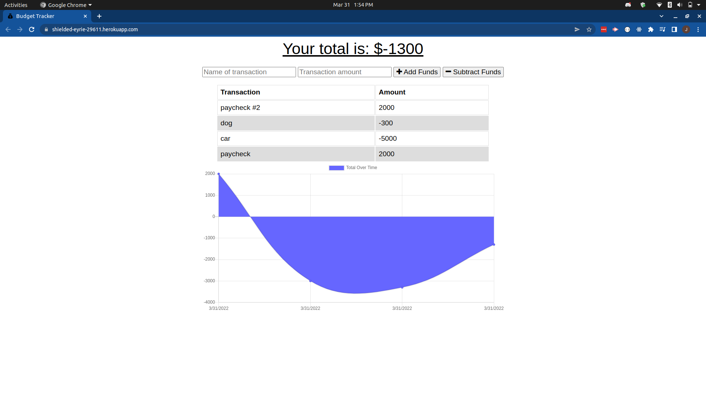

# Budget Tracker
This app allows a user to track personal transactions. Each transaction is added to the table and then the graph below it, which tracks income and expense over time (or, more precisely, over number of transactions), is adjusted.

Given the starter code of a functioning web application, I was able to:
1. make the app functional offline, using indexedDB and service workers, and
2. convert it to a PWA.

## Built With
* JavaScript
* NoSQL/MongoDB

## Screenshot

## Website
https://budget-tracker-app.up.railway.app/

## (Recently Learned) Skills I Used
* Using service workers to cache assets for offline functionality
* Converting an existing web application to a PWA
* Adding a web manifest to an application
